# Splunk-Atomic-Red-Team-ART-Lab-Setup
This is an assignment for course CSE 802: Information Security and Cryptography, Dhaka University-2026, PMICS Batch 6.

                                          🛡️ Splunk & Atomic Red Team (ART) Lab Setup
# 📌 Overview

This project demonstrates the setup of a complete SOC (Security Operations Centre) lab environment using Splunk, Sysmon, and Atomic Red Team (ART).

 # The objective is to:

Forward logs from a Windows machine to Splunk (Kali Linux)

Monitor system activity using Sysmon

Simulate attacks using Atomic Red Team

Prepare the environment for detection engineering

🏗️ Lab Architecture

Kali Linux → Splunk Indexer

Windows Server → Victim Machine + Forwarder + Sysmon + ART

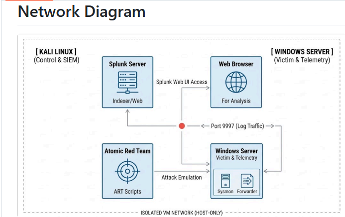

# ⚙️ 1. Splunk Universal Forwarder Installation (Windows)
## 1.1 Download Splunk Universal Forwarder

Download Splunk Universal Forwarder (UF) from the official Splunk website.
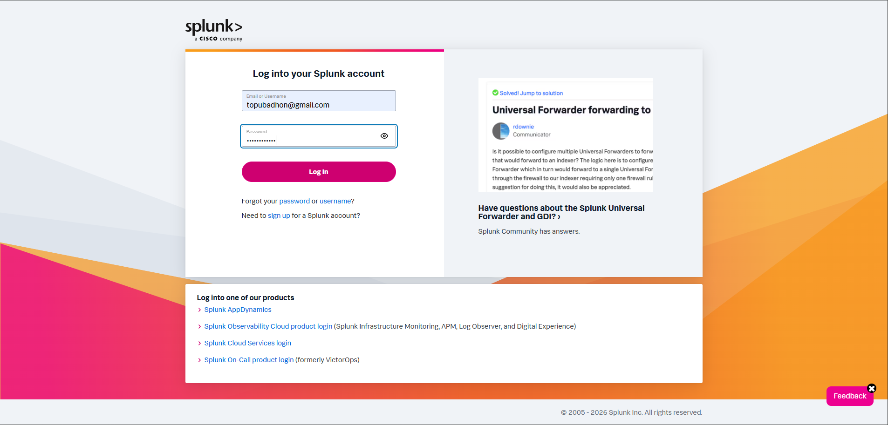

Select Required one and download

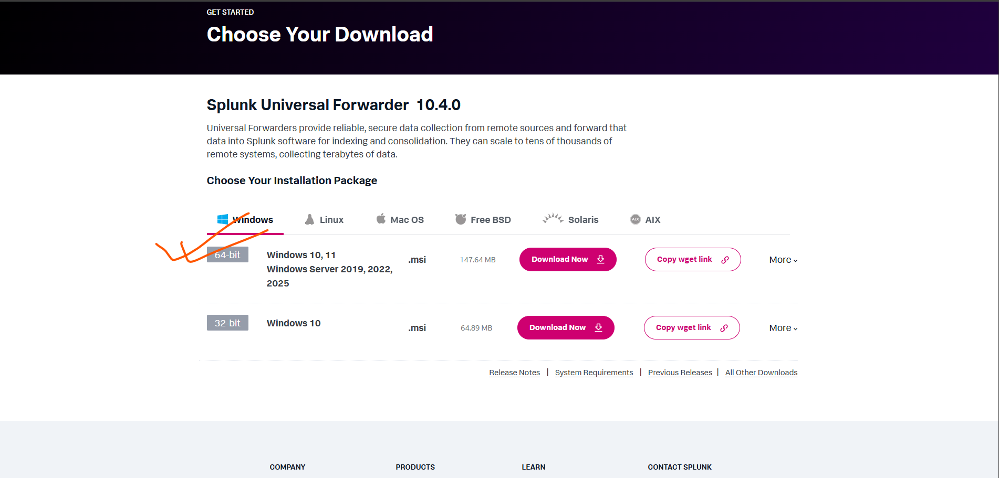

## 1.2 Installation Steps

Run the installer on the Windows (victim) machine and Accept the license agreement to proceed.

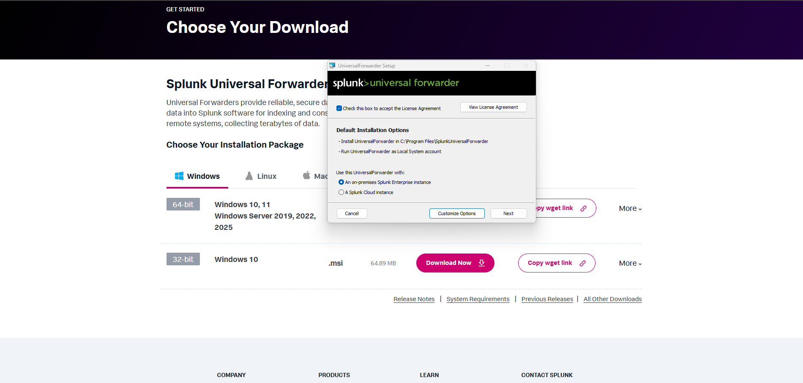

Set a username and password

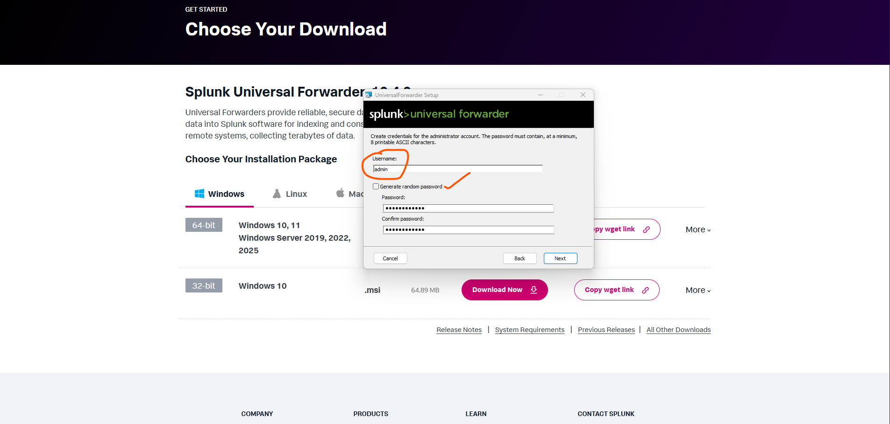


These credentials are used later for troubleshooting and configuration on victim UF client.

## 1.3 Universal Forwardar Configuration(Victim Machine)

Deployment Server configuration is optional for this lab.

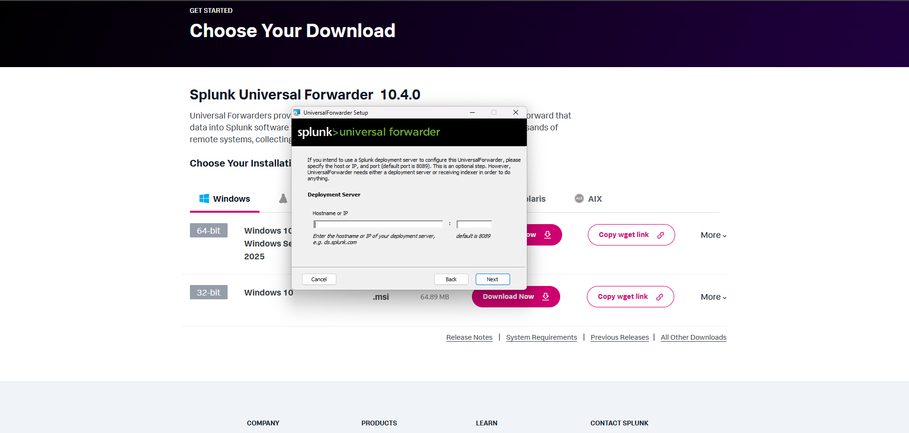

Configure receiving indexer IP: 192.168.65.140(Kali Splunk Indexer)

Use default port: 9997

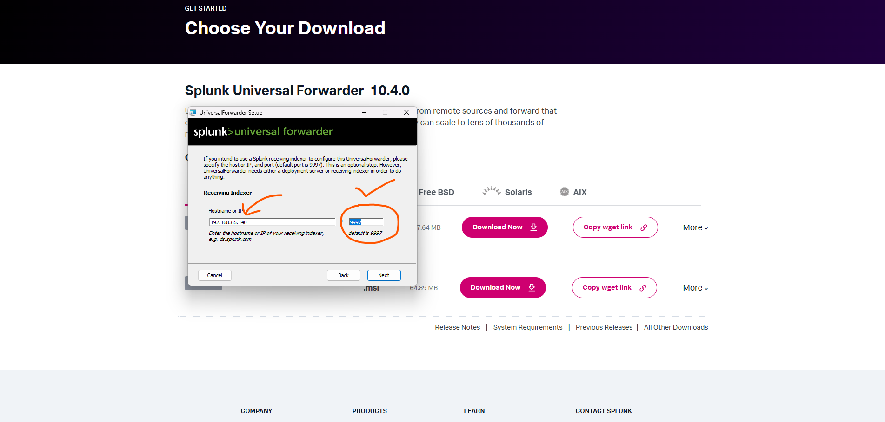


Then Complete the UF client installtion and configuration.

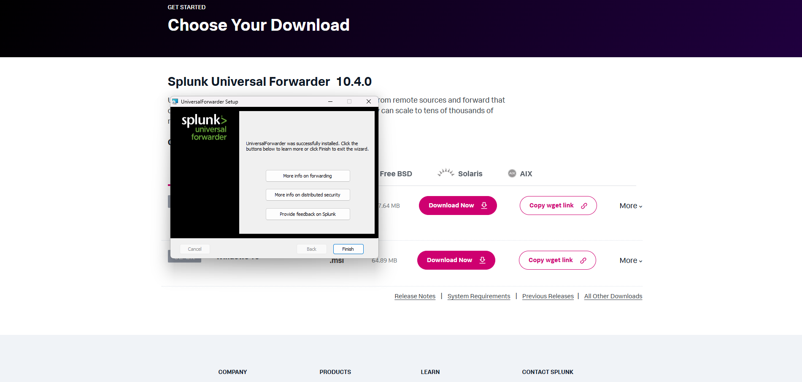

## 1.4 Post Installation Configuration

Navigate to: C:\Program Files\SplunkUniversalForwarder\etc\system\local

Create or edit inputs.conf

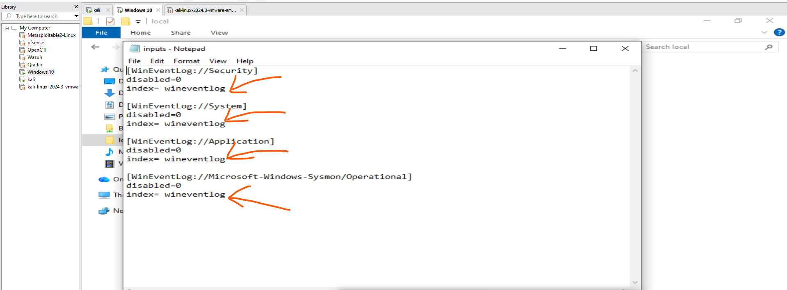

Configure log forwarding ( index = wineventlog )

⚠️ Ensure index name matches the index created in Splunk (Kali)

# 🖥️ 2. Splunk Indexer Setup (Kali Linux)
## 2.1 Download & Install Splunk

Download Splunk on Kali Linux.

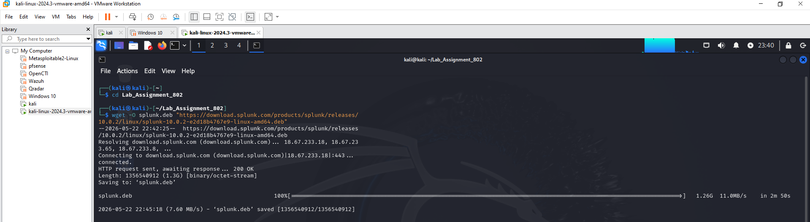

Install Splunk on Kali Linux. During Installation, setup the admin creds for GUI access and Management.

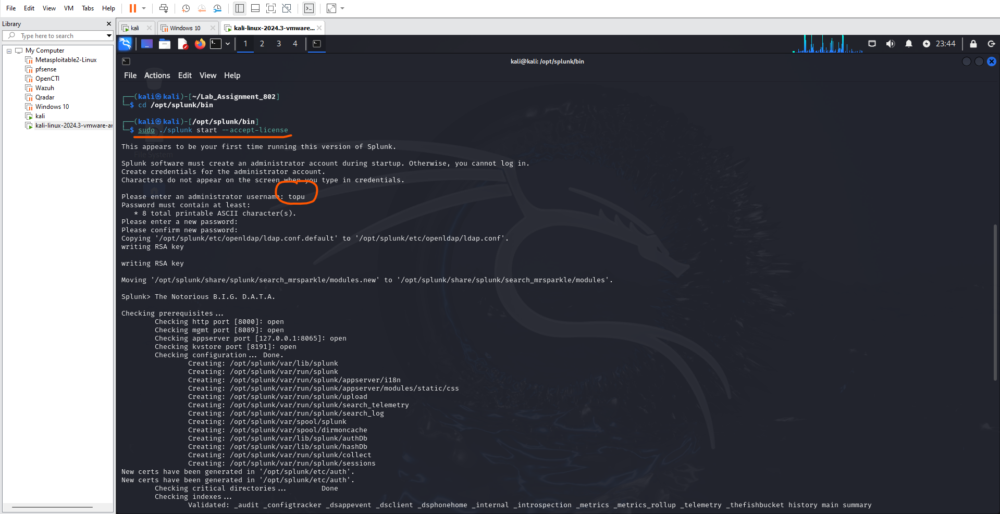

Splunk service should be running properly.

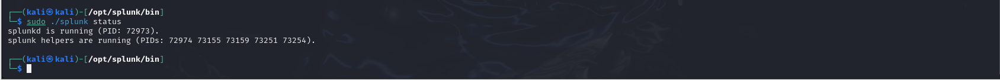

## 2.2 Access Splunk Web GUI

Open browser and access Splunk

Login with configured credentials (e.g., topu)

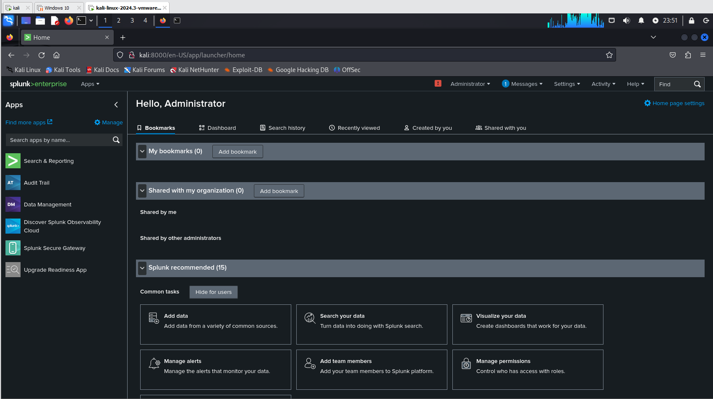


## 2.3 Configure Kali Indexer from GUI

To Create Index

Navigate:

Settings → Indexes
Create a new index
Ensure name matches inputs.conf

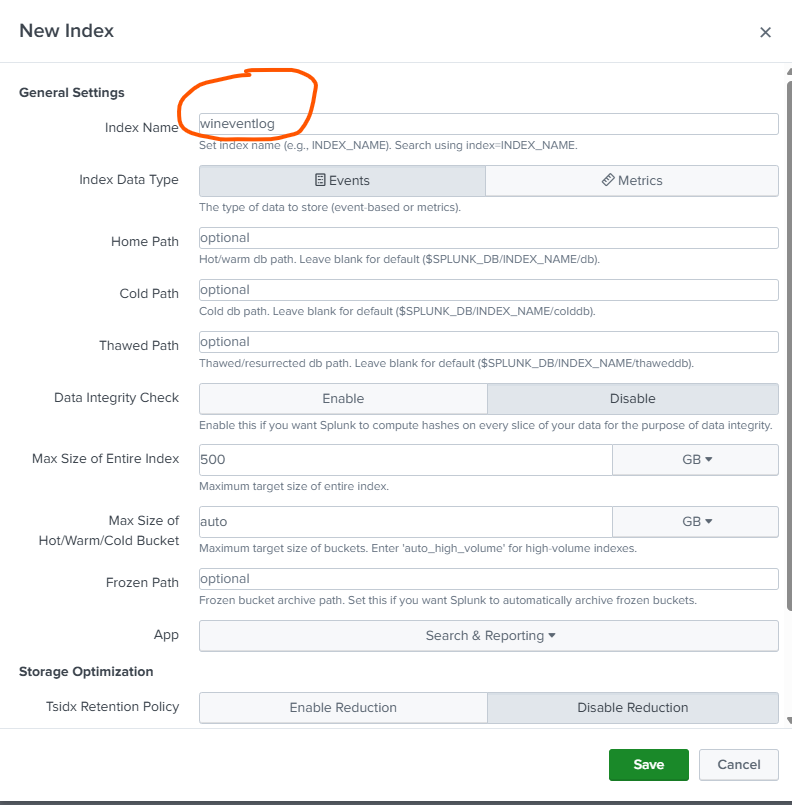

This name is mentioned in step 1.4 Post Installation Configuration


## 2.4 Configure Receiving Port

Go to Forwarding and Receiving -> Click New Receiving Port

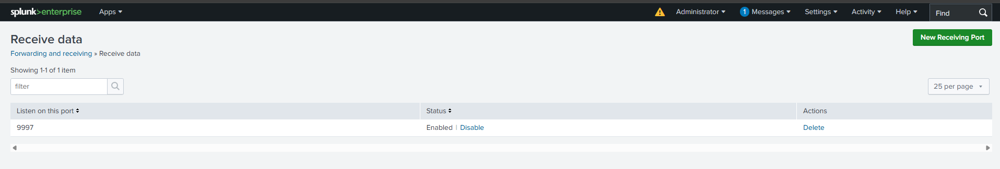

Add port: 9997

Set status: Enabled
# 🔍 3. Sysmon Installation (Windows)
## 3.1 Download Sysmon

Download Sysmon executable from Official Link : https://learn.microsoft.com/en-us/sysinternals/downloads/sysmon

Extract files

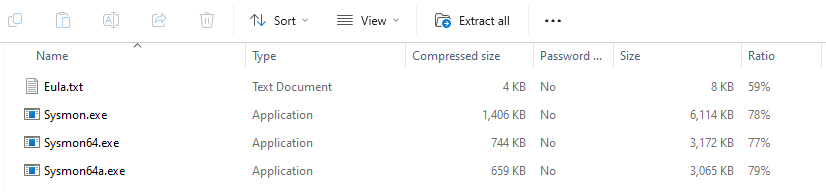

## 3.2 Apply Configuration

Download Sysmon XML config from here : https://wazuh.com/resources/blog/emulation-of-attack-techniques-and-detection-with-wazuh/sysmonconfig.xml

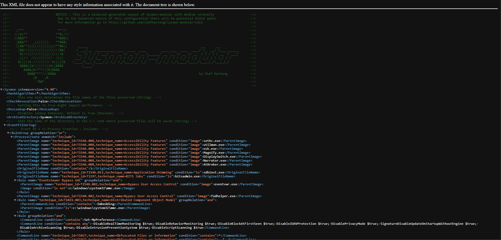

Place XML in same directory

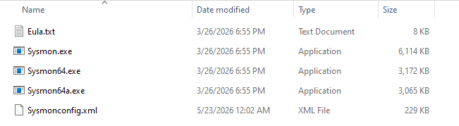

## 3.3 Install Sysmon

Install using configuration(downloaded from wazuh sites) file:

```spl
Sysmon64.exe -accepteula -i sysmonconfig.xml
```
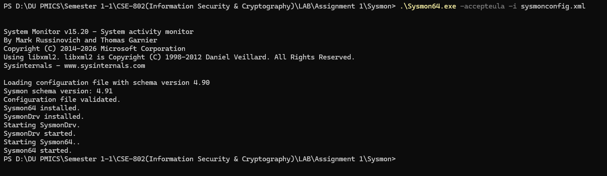

# 🔄 4. Forwarder Validation(on Victim Machine)

## 4.1 Check Forwarding Status

Run:
```spl
splunk list forward-server
```
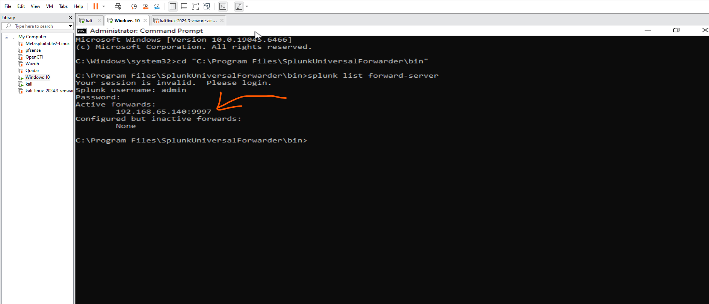

This confirms:

Active forwarder

Destination (Kali IP-Indexer)

Port 9997

## 4.2 Verify Logs in Splunk

Open Splunk GUI (Kali)

Search logs

Logs should appear under: index=wineventlog

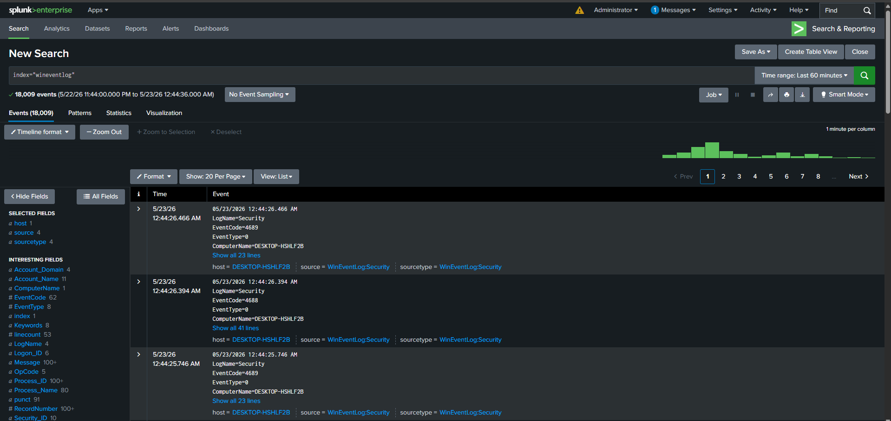

# ⚔️ 5. Atomic Red Team (ART) Setup on Victim Windows Machine
## 5.1 Pre-requisite

Disable Windows Defender real-time protection. To run the installation hassle free and perfectly on windows, we need to disable windows defender and stop the real time monitoring. Otherwise all the attack files will be removed/quarantine. 

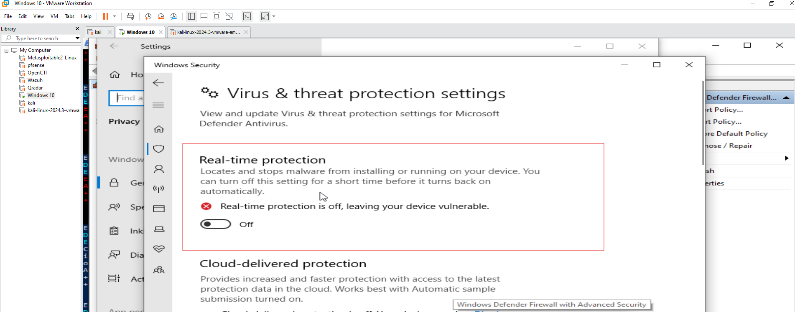
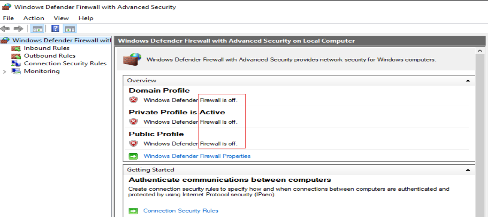

(This prevents scripts from being blocked)

## 5.2 Install Atomic Red Team

Run on Windows Powershell:

```spl
IEX (IWR 'https://raw.githubusercontent.com/redcanaryco/invoke-atomicredteam/master/install-atomicredteam.ps1')
```
Download attack definitions:

```spl
Install-AtomicRedTeam -getAtomics
```
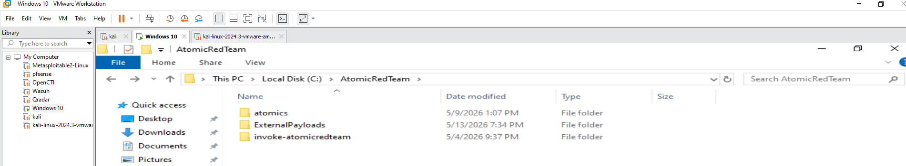
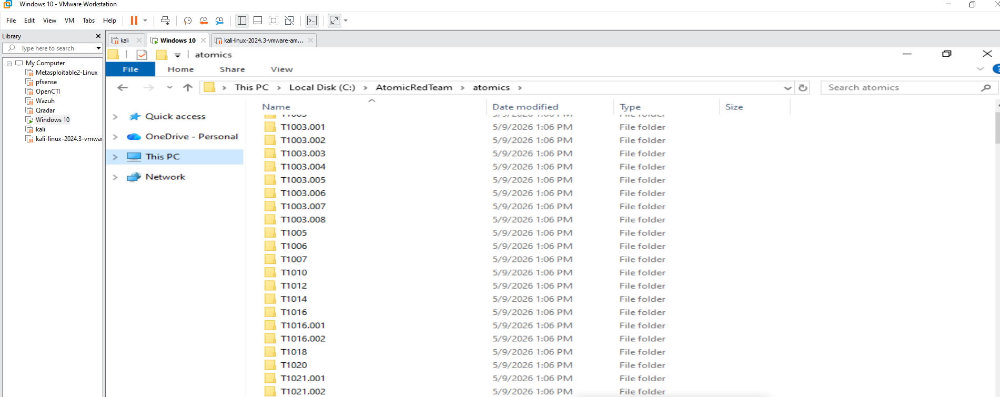

All the attack config file to invoke specific mitre attack. 

Files are downloaded locally to execute.


## 5.3 PowerShell Configuration

Need to apply below commands one by one. 

Enable TLS 1.2
```spl
[Net.ServicePointManager]::SecurityProtocol = [Net.SecurityProtocolType]::Tls12
```
Install package manager
```spl
Install-PackageProvider -Name NuGet -MinimumVersion 2.8.5.201 -Force
```
Avoid confirmation prompts during installs
```spl
Set-PSRepository -Name "PSGallery" -InstallationPolicy Trusted
```

## 5.4 Install Required Modules

Fix module install issues

```spl
Install-Module PowerShellGet -Force -AllowClobber
```
Install the main tool

```spl
Install-Module Invoke-AtomicRedTeam -Force
```
Load commands like Invoke-AtomicTest

```spl
Import-Module Invoke-AtomicRedTeam
```
Allow scripts to run, PowerShell blocks scripts by default.

```spl
Set-ExecutionPolicy Bypass -Scope Process -Force
```
## 5.5 Set Atomic Path

To set the environment path so that every time it takes the specific mitre attack from this designated path to be executed.

```spl
$env:PathToAtomicsFolder="C:\AtomicRedTeam\atomics"
```
## 5.6 Validate Installation

```spl
Get-Command Invoke-AtomicTest
```
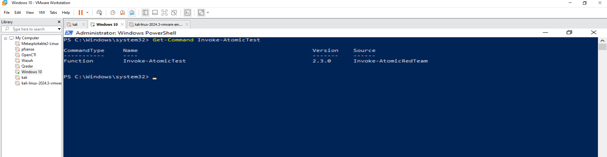

Expected version: 2.3.0

## 5.7 Install Additional Modules

```spl
Install-Module -Name AtomicTestHarnesses -Scope CurrentUser -Force

Import-Module AtomicTestHarnesses
```
Install extra module, provides additional helpers for tests because Some tests require dependencies.

# 📊 6. Log Monitoring in Splunk

Once setup is complete:

Sysmon logs will be forwarded to Splunk
Logs can be searched and analyzed

Executing test: T1059.001 for sample mitre attack test using ART. 

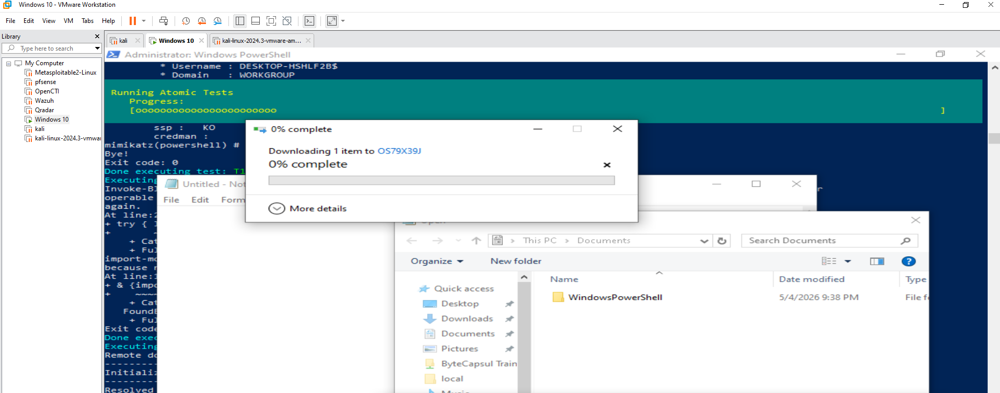

# 🎯 7. Attack Simulation & Detection Output

This segment will contain 5 attacks based on the MITRE ATTACK Framework, the SPL Query used to detect each of the five attacks and a brief explanation of which Sysmon Event ID (e.g., Event ID 1 or 10) was most helpful.


## 7.1 T1053.005 (Persistence) | Scheduled Task: Create a task that runs a hidden script every minute.

Attack Simulation: I initiated the ART attack simulation(Invoke-AtomicTest T1053.005) on the victim Windows machine to generate relevant event logs. These logs are then forwarded to the Splunk dashboard through Sysmon and the Splunk Universal Forwarder (UF). The following section outlines the attack simulation process.

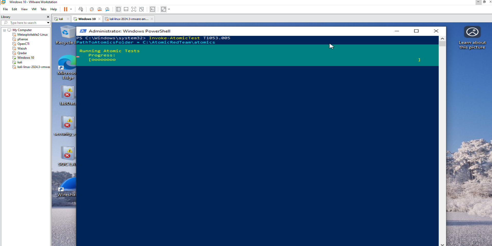

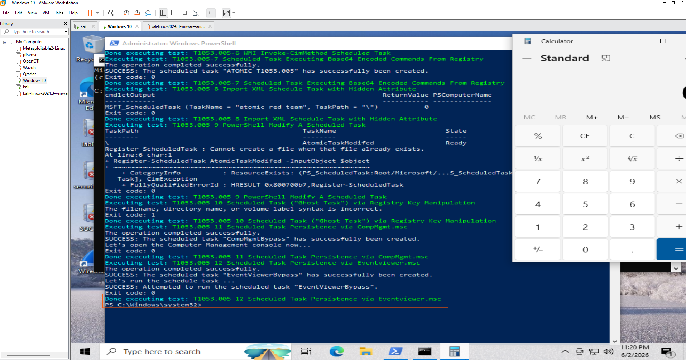

SPL Query I used:

```spl
index=wineventlog (EventCode=4698 OR EventCode=106 OR EventCode=1 OR EventCode=4688 OR EventCode=11 OR EventCode=7)
| eval Activity = case(
    EventCode=4698, "Task Created (Security)",
    EventCode=106, "Task Registered (Task-Sched)",
    EventCode=1 OR EventCode=4688, "Process Execution",
    EventCode=11, "File Created (Sysmon)",
    EventCode=7, "Module Loaded (Sysmon)",
    1=1, "Other Activity")
| eval task_info = coalesce(TaskName, Task_Name, "N/A")
| eval user_info = coalesce(user, SubjectUserName, User, "N/A")
| eval process_info = coalesce(Image, NewProcessName, "N/A")
| eval is_suspicious=if(NOT match(task_info, "^\\\\Microsoft\\\\Windows\\\\.*") AND (match(CommandLine, ".*(powershell|cmd|temp|AppData).*") OR task_info!="N/A"), "HIGH", "LOW")
| table _time, dest, user_info, Activity, EventCode, task_info, process_info, CommandLine, is_suspicious
| sort - _time v
```

SPL Query on Splunk:

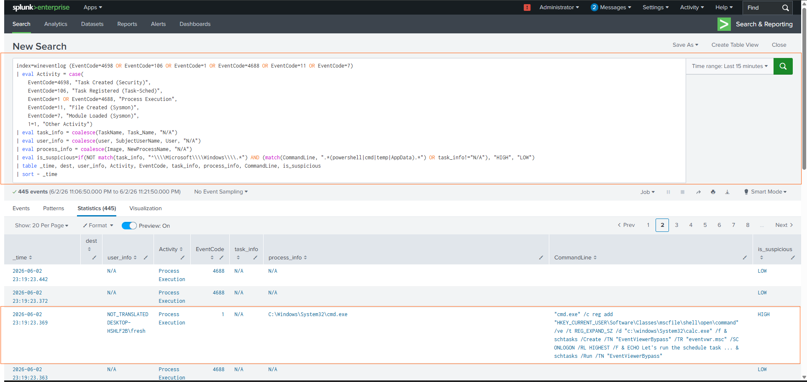


Detected Event using the SPL:

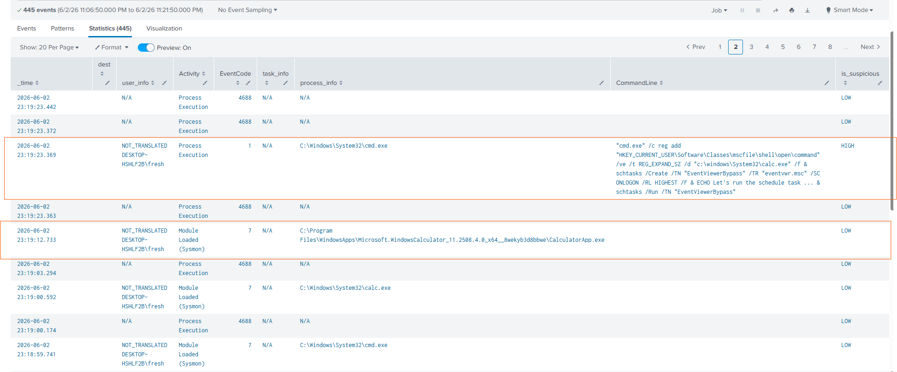

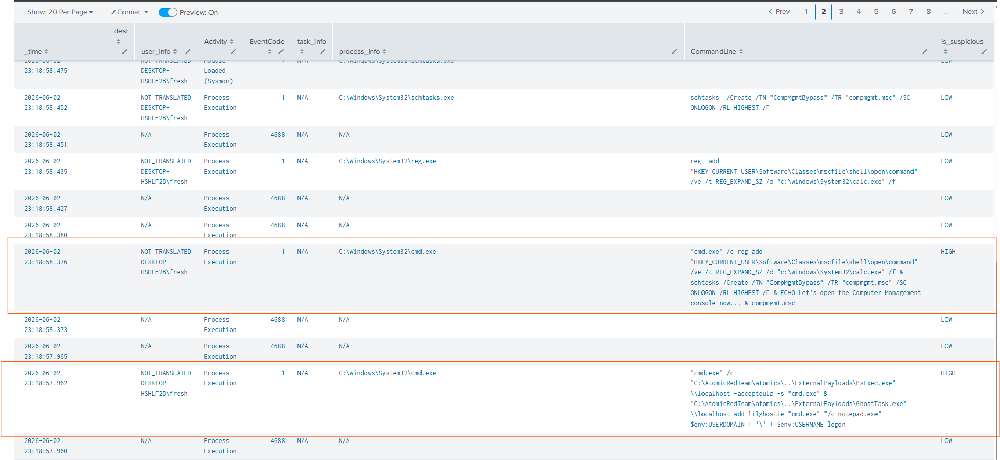

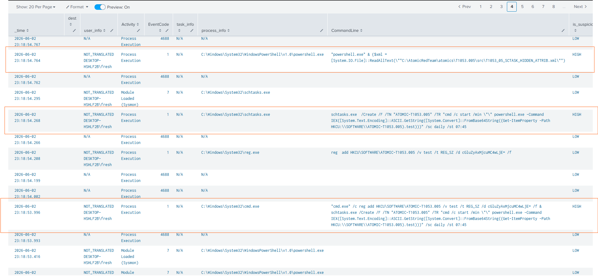


Explanation on Sysmon Event ID:

Sysmon Event ID 1 is most helpful because it captures the exact CommandLine and parent processes where administrative tools like cmd.exe, schtasks.exe, and reg.exe are abused to establish persistence and elevate privileges. Specifically, it reveals high-risk behaviours such as:

-- Registry Hijacking for UAC Bypass: It shows cmd.exe executing reg add to modify the default execution path of trusted Management Console structures like mscfile\shell\open\command. This provides the precise command lines used to force auto-elevating binaries (eventvwr.msc and compmgmt.msc) to run unauthorised applications like calc.exe with administrative rights.

-- Obfuscated PowerShell Script Execution: It exposes powershell.exe being launched to decode and execute fileless payloads on the fly. It captures the full string where Base64-encoded commands are pulled directly from custom registry keys (HKCU:\SOFTWARE\ATOMIC-T1053.005) and evaluated using IEX, bypassing standard file-based detection.

-- Scheduled Task Persistence Registration: It details the exact parameters used during task creation (schtasks /Create), including the task names (EventViewerBypass, CompMgmtBypass, ATOMIC-T1053.005), highest privilege execution flags (/RL HIGHEST), and execution triggers (/SC ONLOGON, /sc daily).

-- Advanced Offensive Tooling: It records the execution of native and third-party binaries used for privilege escalation and stealth task registration, tracking the launch of PsExec.exe to spawn a SYSTEM shell and GhostTask.exe to manipulate scheduled tasks outside of standard event logging.


## 7.2 T1218.005 (Defence Evasion) | MSHTA: Execute a malicious remote .hta file to bypass app control


Attack Simulation: I initiated the ART attack simulation(Invoke-AtomicTest T1218.005) on the victim Windows machine to generate relevant event logs. These logs are then forwarded to the Splunk dashboard through Sysmon and the Splunk Universal Forwarder (UF). The following section outlines the attack simulation process.

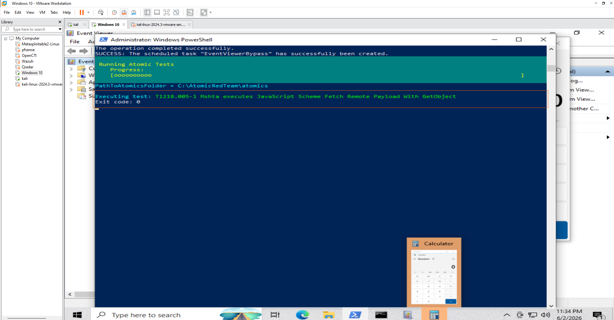

SPL Query I used:

```spl

index=wineventlog (sourcetype="XmlWinEventLog:Microsoft-Windows-Sysmon/Operational" OR "Sysmon" OR "Microsoft-Windows-Sysmon")
(EventCode=1 OR EventID=1 OR EventCode=4688 OR EventCode=7 OR EventCode=11)

(Image="*\\mshta.exe" OR OriginalFileName="MSHTA.EXE")

(
    CommandLine="*http://*"
    OR CommandLine="*https://*"
    OR CommandLine="*.hta*"
    OR CommandLine="*vbscript:*"
    OR CommandLine="*javascript:*"
    OR CommandLine="*AppData*"
    OR CommandLine="*Temp*"
)

| eval Activity = "MSHTA Execution (T1218.005 - Defense Evasion)"

| eval Time=strftime(_time,"%Y-%m-%d %H:%M:%S")

| eval user_info=coalesce(User, user, SubjectUserName, AccountName, "N/A")

| eval process_info=coalesce(Image, ProcessName, "N/A")

| eval process_name=mvindex(split(process_info,"\\"),-1)

| eval cmdline=coalesce(CommandLine, Process_Command_Line, "N/A")

| eval parent_process=coalesce(ParentImage, ParentProcessName, ParentCommandLine, "N/A")

| eval is_suspicious=case(
    match(cmdline,"(?i)http://|https://"), "HIGH - Remote Payload Execution",
    match(cmdline,"(?i)javascript:|vbscript:"), "HIGH - Script Execution (LOLBIN Abuse)",
    match(cmdline,"(?i)\.hta"), "HIGH - HTA Payload",
    match(cmdline,"(?i)AppData|Temp|Users"), "HIGH - Suspicious Execution Path",
    parent_process!="N/A" AND NOT match(parent_process,"(?i)explorer.exe|cmd.exe|powershell.exe|winword.exe|excel.exe"), "MEDIUM - Unusual Parent Process",
    1=1, "LOW"
)

| eval mitre_technique="T1218.005 - MSHTA Defense Evasion"

| table Time host user_info Activity EventCode process_name process_info cmdline parent_process is_suspicious mitre_technique

| sort -_time

```

SPL Query on Splunk:

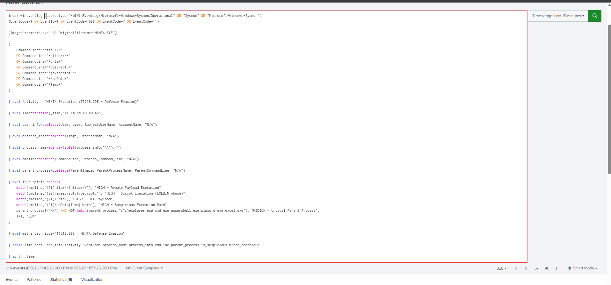

Detected Event using the SPL:

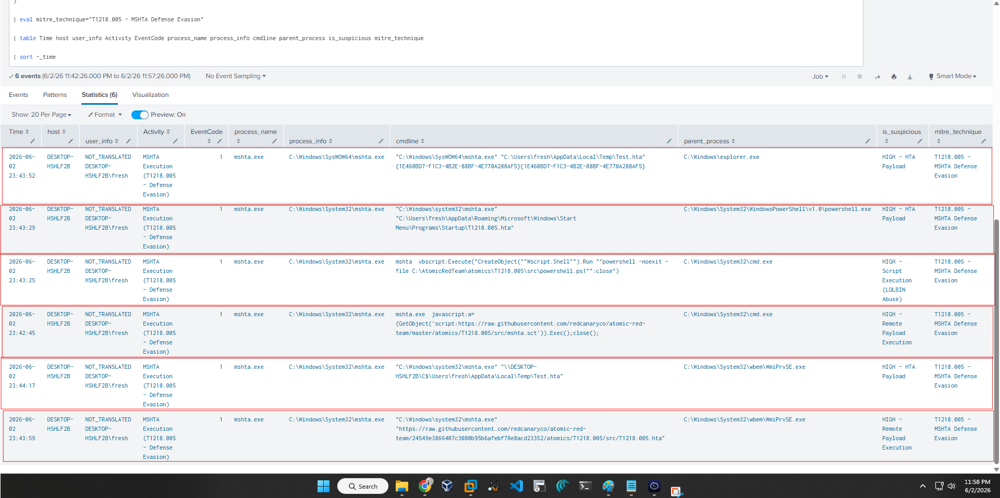


Explanation on Sysmon Event ID:

Sysmon Event ID 1 is most helpful because it captures the exact cmdline and parent processes where mshta.exe is abused for defence evasion (MITRE T1218.005). Specifically, it provides the required process names, execution strings, and timestamps for:

-- Remote Payload Execution: It exposes mshta.exe reaching directly out to external URLs to fetch and execute remote .hta or .sct files, bypassing standard perimeter controls.

-- Inline Scripting Abuse: It captures inline VBScript or JavaScript execution (e.g., calling Wscript.Shell or GetObject), allowing attackers to launch secondary payloads like PowerShell filelessly.

-- Suspicious Parent Processes: It highlights instances where mshta.exe is anomalously spawned by non-standard parents like cmd.exe, powershell.exe, or WmiPrvSE.exe rather than a standard system sequence.

-- Persistence Placement: It documents the absolute paths of targeted files, explicitly flagging instances where payloads are dropped into highly sensitive locations like the user's Startup folder.


## 7.3 T1003.001 (Credential Access) | LSASS Dumping: Use procdump to steal credentials from memory.

Attack Simulation: I initiated the ART attack simulation(Invoke-AtomicTest T1003.001) on the victim Windows machine to generate relevant event logs. These logs are then forwarded to the Splunk dashboard through Sysmon and the Splunk Universal Forwarder (UF). The following section outlines the attack simulation process.

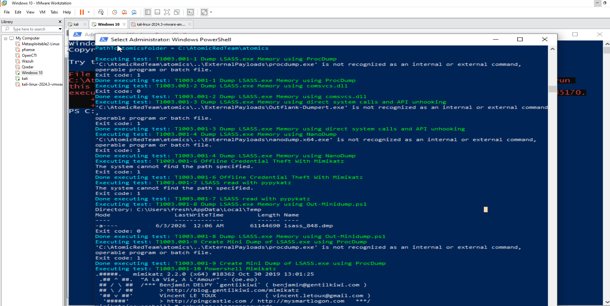

SPL Query I used:

```spl

index=wineventlog (
    (EventCode=10 AND TargetImage="*\\lsass.exe")
    OR
    (EventCode=11 AND TargetFilename="*.dmp")
)

| eval Activity=case(
    EventCode=10, "LSASS Access Detected (Process Access)",
    EventCode=11, "Memory Dump File Created",
    1=1, "Other Activity"
)

| eval Time=strftime(_time,"%Y-%m-%d %H:%M:%S")

| eval host=coalesce(Computer, host)

| eval user_info=coalesce(User, user, SubjectUserName, AccountName, "N/A")

| eval process_info=coalesce(SourceImage, Image, ProcessName, "N/A")

| eval process_name=mvindex(split(process_info,"\\"),-1)

| eval target_process=coalesce(TargetImage, "N/A")

| eval cmdline=coalesce(CommandLine, Process_Command_Line, "N/A")

| eval file_dump=coalesce(TargetFilename, "N/A")

| eval access_level=coalesce(GrantedAccess, "N/A")

| eval detection_type=case(
    EventCode=10 AND match(target_process,"(?i)lsass"), "LSASS Memory Access (Direct)",
    EventCode=11 AND match(file_dump,"(?i)\.dmp"), "Memory Dump File Created",
    1=1, "Suspicious Activity"
)

| eval is_suspicious=case(
    EventCode=10 AND match(access_level,"(?i)0x1fffff|0x1f3fff|0x1f0fff"), "CRITICAL - Full LSASS Access",
    EventCode=11 AND match(file_dump,"(?i)\.dmp"), "HIGH - Dump File Generated",
    match(process_info,"(?i)procdump|rundll32|taskmgr|powershell|wmic"), "HIGH - Known Dump Tool",
    1=1, "MEDIUM"
)

| eval mitre_technique="T1003.001 - LSASS Credential Dumping"

| table Time host user_info EventCode Activity process_name process_info target_process cmdline access_level file_dump detection_type is_suspicious mitre_technique

| sort - _time

```

SPL Query on Splunk:

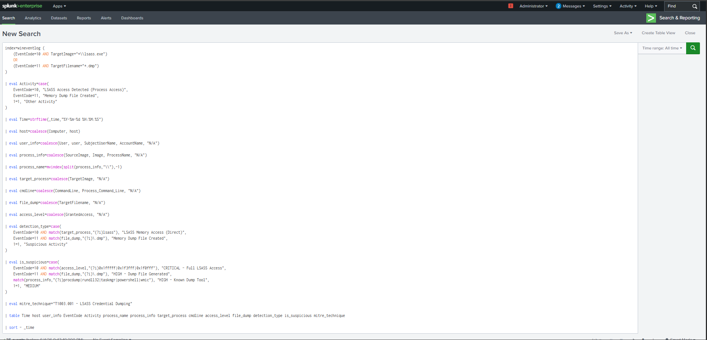


Detected Event using the SPL:

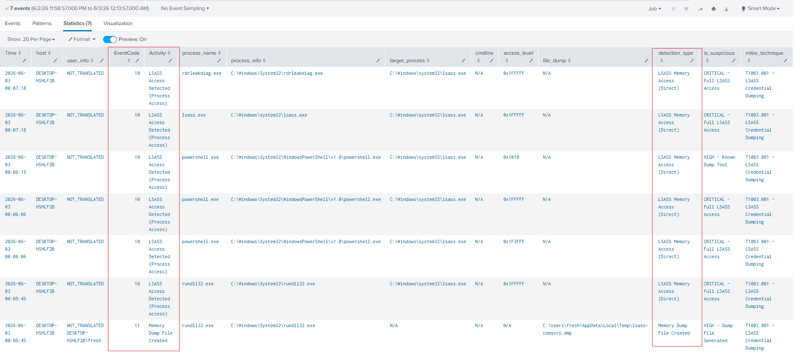

Explanation on Sysmon Event ID:

Sysmon Event IDs 10 (Process Access) and 11 (File Create) are most helpful because they capture memory reading and dumping behaviours targeting the Local Security Authority Subsystem Service (lsass.exe) for credential dumping (MITRE T1003.001). Specifically, they provide the required process names, target paths, and access masks for:

-- Direct Memory Access Tracking: Sysmon ID 10 exposes source processes (like powershell.exe, rundll32.exe, and rdrleakdiag.exe) requesting handles to read the virtual memory space of target_process: lsass.exe.

-- Highly Suspicious Access Masks: It logs precise access_level permissions—such as 0x1FFFFF (Full Access) or 0x1F3FFF—which are indicators of processes attempting to harvest NTLM hashes or Kerberos tickets.

-- Malicious Tool/Living-of-the-Land Identification: It highlights non-standard applications accessing LSASS memory directly, tracking both scripting hosts (powershell.exe) and diagnostic tools (rdrleakdiag.exe) acting as dump tools.

-- Physical Dump File Creation: Sysmon ID 11 links memory access to disk activity, recording the exact file_dump path (e.g., ...\AppData\Local\Temp\lsass-comsvcs.dmp) when native binaries like rundll32.exe invoke comsvcs.dll to write the stolen credentials to disk.


## 7.4 T1059.001 (Execution) | PowerShell Download: Download and execute a script from the web.

Attack Simulation: I initiated the ART attack simulation(Invoke-AtomicTest T1059.001) on the victim Windows machine to generate relevant event logs. These logs are then forwarded to the Splunk dashboard through Sysmon and the Splunk Universal Forwarder (UF). The following section outlines the attack simulation process.

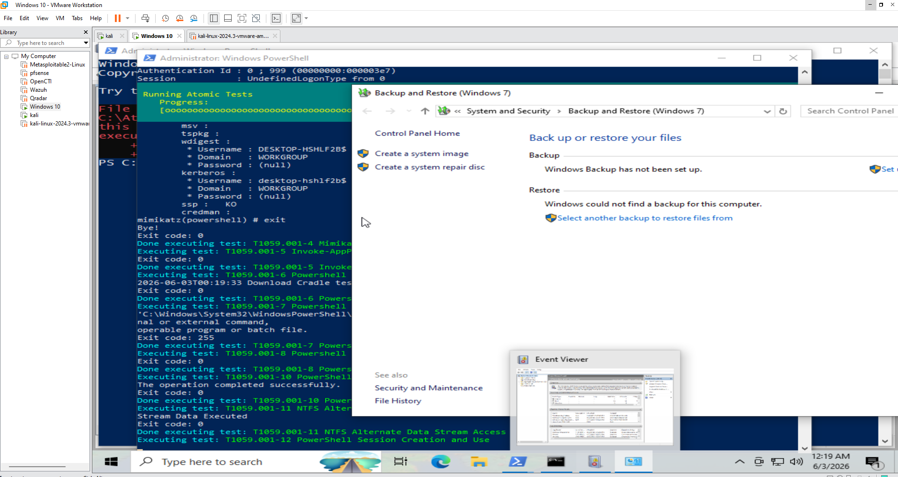

SPL Query I used:

```spl

index=wineventlog

(EventCode=1 OR EventCode=4688 OR EventID=1)

(Image="*\\powershell.exe" OR Image="*\\pwsh.exe" OR NewProcessName="*\\powershell.exe" OR NewProcessName="*\\pwsh.exe")

(CommandLine="*Invoke-WebRequest*" OR CommandLine="*IEX*" OR CommandLine="*Invoke-Expression*" OR CommandLine="*DownloadString*" OR CommandLine="*Net.WebClient*" OR CommandLine="*Start-BitsTransfer*" OR CommandLine="*curl*" OR CommandLine="*wget*" OR CommandLine="*http://*" OR CommandLine="*https://*" OR CommandLine="*-enc*" OR CommandLine="*EncodedCommand*")

| eval Activity="PowerShell Execution - Download / Payload Staging (T1059.001)"

| eval Time=strftime(_time,"%Y-%m-%d %H:%M:%S")

| eval host=coalesce(host, Computer)

| eval user_info=coalesce(User, user, SubjectUserName, AccountName, "N/A")

| eval process_info=coalesce(Image, NewProcessName, ProcessName)

| eval process_name=mvindex(split(process_info,"\\"),-1)

| eval cmdline=coalesce(CommandLine, Process_Command_Line, "N/A")

| eval parent_process=coalesce(ParentImage, ParentProcessName)

| eval event_source=case(
    EventCode=1 OR EventID=1, "Sysmon",
    EventCode=4688, "Windows Security",
    1=1, "Unknown"
)

| eval technique="T1059.001 - PowerShell Execution"

| eval is_suspicious=case(
    match(cmdline,"(?i)Invoke-WebRequest|DownloadString|Net.WebClient|Start-BitsTransfer"), "HIGH - File Download via PowerShell",
    match(cmdline,"(?i)IEX|Invoke-Expression"), "CRITICAL - Code Injection Execution",
    match(cmdline,"(?i)-enc|EncodedCommand"), "CRITICAL - Obfuscation",
    match(cmdline,"(?i)http://|https://"), "HIGH - Remote URL Execution",
    1=1, "MEDIUM"
)

| table Time user_info EventCode process_name technique parent_process is_suspicious cmdline

| sort - _time

```

SPL Query on Splunk:

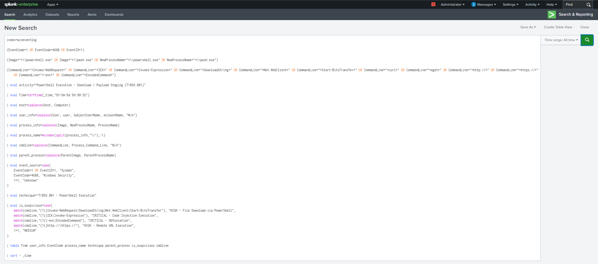


Detected Event using the SPL:

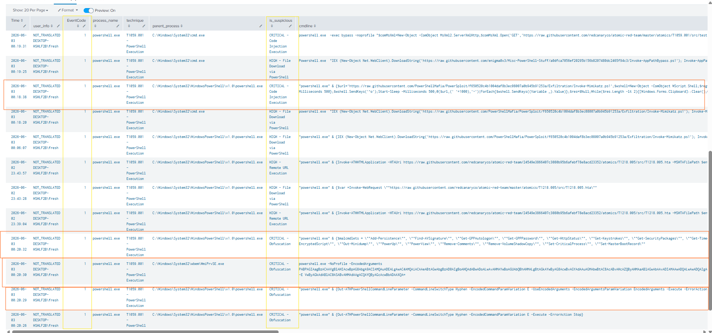

Explanation on Sysmon Event ID:

Sysmon Event ID 1 is most helpful because it captures the exact cmdline and parent processes where powershell.exe is abused for command and script execution (MITRE T1059.001). Specifically, it provides the required process names, execution strings, and timestamps for:

-- Remote Script Download and Execution: It exposes PowerShell launching web requests (DownloadString, Invoke-WebRequest, or Msxml2.ServerXMLHTTP) to fetch and execute payloads directly from external repositories like GitHub (e.g., Invoke-Mimikatz.ps1).

-- Advanced Command Obfuscation: It captures attempts to hide execution intent by logging heavily obfuscated, Base64-encoded command parameters (-EncodedArguments) alongside complex environment variable variations.

-- In-Memory Payload Loading: It logs the identification of strings and arrays of sensitive cmdlets (such as PowerUp, PowerView, Get-Keystrokes, and Add-Persistence) passed directly into memory to avoid disk-based detection.

-- Suspicious Shell Spawning: It details abnormal operational behaviour, documenting instances where powershell.exe is recursively spawned by another PowerShell instance or triggered remotely via the Windows Management Instrumentation service (WmiPrvSE.exe).

## 7.5 T1112 (Defence Evasion) | Registry Modification: Disable Windows Defender via Registry keys.

Attack Simulation: I initiated the ART attack simulation(Invoke-AtomicTest T1112) on the victim Windows machine to generate relevant event logs. These logs are then forwarded to the Splunk dashboard through Sysmon and the Splunk Universal Forwarder (UF). The following section outlines the attack simulation process.


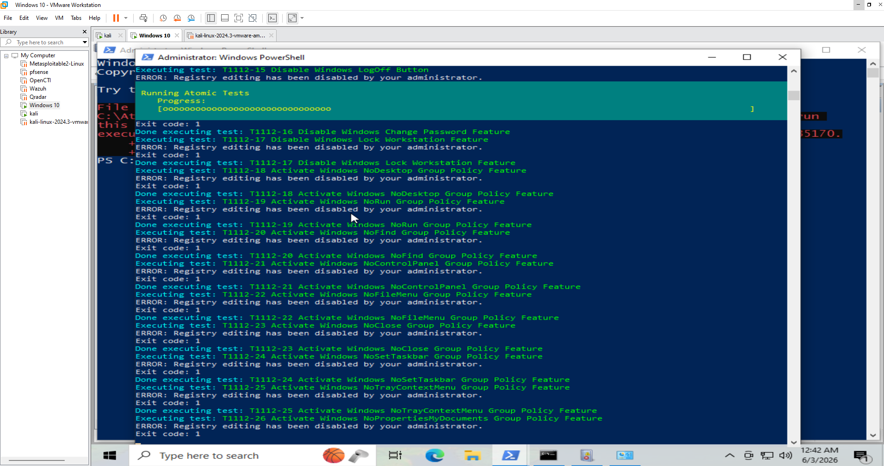

SPL Query I used:

```spl

index=wineventlog (sourcetype="XmlWinEventLog:Microsoft-Windows-Sysmon/Operational" OR "Sysmon" OR "Microsoft-Windows-Sysmon")

(EventCode=1 OR EventID=1 OR EventCode=4688 OR EventCode=7 OR EventCode=11)

(
    Image="*\\reg.exe"
    OR Image="*\\powershell.exe"
    OR Image="*\\pwsh.exe"
    OR Image="*\\cmd.exe"
)

(
    CommandLine="*Windows Defender*"
    OR CommandLine="*DisableAntiSpyware*"
    OR CommandLine="*TamperProtection*"
    OR CommandLine="*DisableNotifications*"
    OR CommandLine="*Notification_Suppress*"
    OR CommandLine="*DisableRealtimeMonitoring*"
    OR CommandLine="*DisableBehaviorMonitoring*"
    OR CommandLine="*DisableOnAccessProtection*"
    OR CommandLine="*Set-MpPreference*"
    OR CommandLine="*Add-MpPreference*"
    OR CommandLine="*MpPreference*"
    OR CommandLine="*Defender*"
)

| eval Activity="Registry / Defender Tampering (T1112 - Defense Evasion)"

| eval Time=strftime(_time,"%Y-%m-%d %H:%M:%S")

| eval host=coalesce(host, Computer)

| eval user_info=coalesce(User, user, SubjectUserName, AccountName, "N/A")

| eval process_info=coalesce(Image, ProcessName)

| eval process_name=mvindex(split(process_info,"\\"),-1)

| eval cmdline=coalesce(CommandLine, Process_Command_Line, "N/A")

| eval parent_process=coalesce(ParentImage, ParentProcessName, ParentCommandLine, "N/A")

| eval technique="T1112 - Modify Registry"

| eval detection_type=case(
    match(cmdline,"(?i)Set-MpPreference|Add-MpPreference"), "CRITICAL - Defender Policy Modified",
    match(cmdline,"(?i)DisableAntiSpyware|TamperProtection"), "CRITICAL - Defender Disabled",
    match(cmdline,"(?i)DisableRealtimeMonitoring|DisableBehaviorMonitoring"), "HIGH - Real-time Protection Disabled",
    match(cmdline,"(?i)Windows Defender"), "HIGH - Defender Configuration Access",
    match(process_info,"(?i)reg.exe|powershell|pwsh"), "HIGH - Registry Modification Tool",
    1=1, "MEDIUM"
)

| eval is_suspicious=case(
    match(cmdline,"(?i)Set-MpPreference|DisableAntiSpyware|TamperProtection"), "CRITICAL",
    match(cmdline,"(?i)DisableRealtimeMonitoring|DisableBehaviorMonitoring"), "HIGH",
    1=1, "MEDIUM"
)

| table Time host user_info EventCode EventID process_name process_info parent_process cmdline detection_type is_suspicious Activity technique

| sort - _time

```

SPL Query on Splunk:

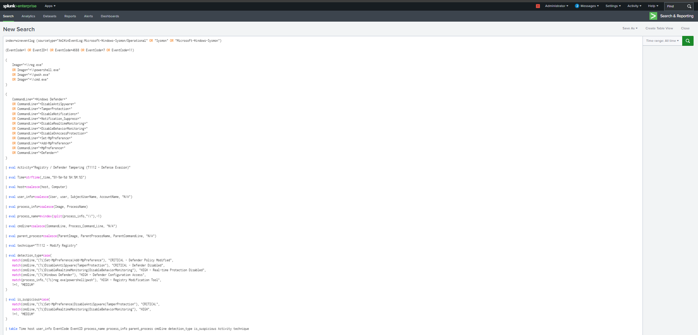


Detected Event using the SPL:

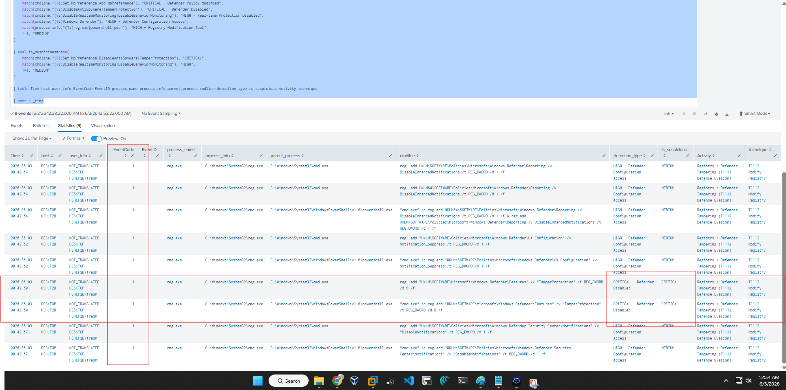

Explanation on Sysmon Event ID:

Sysmon Event ID 1 is most helpful because it captures the exact cmdline and process details where system tools are abused to modify the registry to evade defences (MITRE T1112). Specifically, it provides the required process names, execution strings, and timestamps for:

-- Security Feature Disabling: It highlights critical modifications using reg.exe or cmd.exe to directly shut down core antivirus protections, such as turning off TamperProtection under Windows Defender\Features.

-- Alert and Notification Suppression: It logs commands targeting registry pathways like Windows Defender\UX Configuration and Windows Security Center\Notifications to set Notification_Suppress or DisableNotifications values to 1.

-- Telemetry and Reporting Blindness: It captures registry entries aimed at turning off security health visibility, specifically highlighting changes to Windows Defender\Reporting to implement DisableEnhancedNotifications.

-- Indirect Execution Tracking: It records the relationship between parent and child processes, catching instances where powershell.exe spawns a cmd.exe middleman to issue the malicious reg add configurations.


## 🔐 Final Notes 

All attack simulations were conducted in a controlled lab environment for educational purposes only. 

                         🛡️ Defense | 🔎 Detection | ⚔️ Simulation | 📊 Analysis
